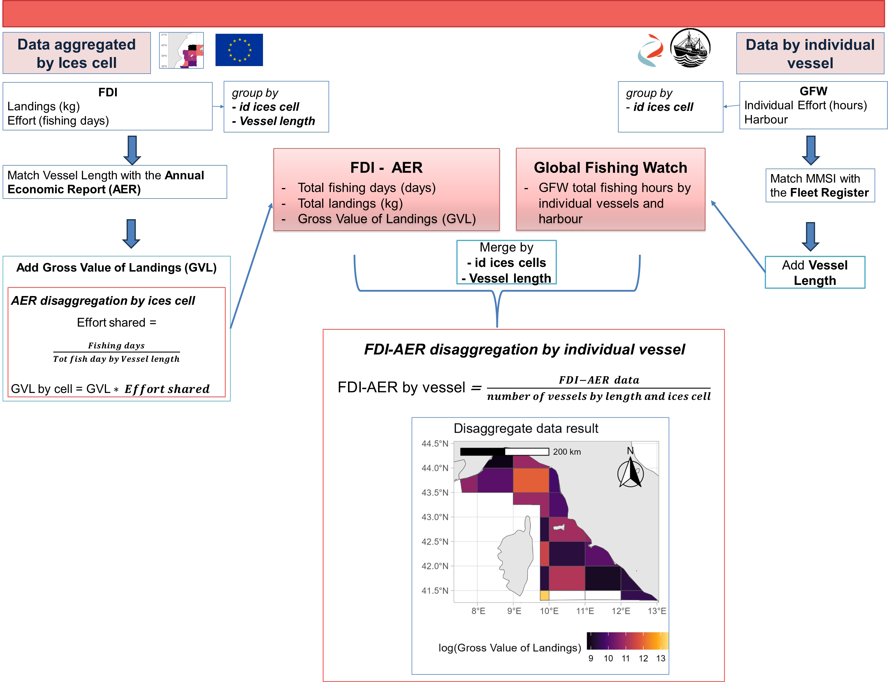

```{r setup, include=FALSE}
knitr::opts_chunk$set(echo = TRUE)
```

# Introduction

The EU Horizon SURIMI project aims to deliver a suite of ready-to-use socio-economic and ecological simulation models that are integrated into the EU Digital Twin Ocean.
These models leverage a wide range of EU fishery activity data, including datasets from the Fisheries Data Collection Framework (DCF), to support evidence-based policy and sustainable management of marine resources.
However, most data are collected in an aggregated form, which limits their spatial resolution and applicability to the fine-scale assessment and simulation of vessel behaviour.
For these reasons, one of the objectives of the SURIMI project is to create a set of algorithms to disaggregate the socio-economic dataset at a finer spatial and technical level or even at the level of individual fishing vessels, using public data and online resources (DCF and Global Fishing Watch). 

### Summary of the procedure

This procedure (Fig XX) outlines a method to estimate fisheries economic indicators at the level of individual vessels and ICES cells by integrating multiple data sources through a disaggregation methodology.
Aggregated data from the EU’s FDI—including effort and landing data —is provided at the ICES cell level and by metier, while the AER database, including economic indicators, is grouped by supra-region, country and fleet segment.
Global Fishing Watch (GFW) data is used to provide total fishing hours per vessel and harbour of landings.

Firstly, the FDI data were matched to the Annual Economic Report of Fisheries (AER) according to vessel length, in order to extract the relevant economic indicators.
For this example, the focus was on the Gross Value of Landings (GVL); however, any information contained in the AER can be extracted.

In parallel, Global Fishing Watch (GFW) data was used to provide information on the effort (hours of fishing) of each individual vessel and their associated harbours for the selected case study.
The MMSI identifier was used to match GFW individual vessels with the EU Fleet Register to assign vessel lengths.
Finally, individual vessels were grouped by ICES cell and length to align with the FDI dataset.

**Note**: Here, we use public GFW data to demonstrate a procedure in cases where access to other types of data is not possible.
However, the GFW dataset is restricted to a few fisheries as it only shows those with AIS coverage.
However, if more detailed data are available—such as those obtained from the Vessel Monitoring System (VMS)—the procedure can be reliably replicated using that dataset as well.

The FDI-AER and GFW datasets were merged using common identifiers (ICES cell and vessel length).
The resulting combined dataset allowed disaggregation of FDI-AER data by individual vessel, computed by dividing total values by the number of vessels in each vessel length and ICES cell.
This enabled spatially explicit estimates of GVL at the vessel level.



## 1 Protocol - FDI effort by ices cell

In this session, the methodology for disaggregating data will be systematically explained through the application in a specific area that is the GSA09 (Northern Tyrrhenian Sea).

**Firstly, to ensure proper data management, it is necessary to download and save the data in a folder specifically dedicated to this purpose.**

The data to be downloaded includes:

| Data | Description |
|------------------------------------|------------------------------------|
| [FDI effort and landing](https://jeodpp.jrc.ec.europa.eu/ftp/jrc-opendata/FAD/fdi/FDI_spatial_data_EU28.zip) | Effort and landing data divided by year, country, GSA, gear, vessel length and ices-cell. The geographical reference, expressed as ices-cell longitude-latitude coordinates, is provided in the shapefiles. |
| [AER](https://stecf.jrc.ec.europa.eu/documents/d/stecf/stecf_24-07_eu-fleet-economic-and-transversal-data) | Economic indicators by year, country, GSA, gear, and vessel length. |
| [Fleet register](https://webgate.ec.europa.eu/fleet-europa/search_en) | Descriptive information on individual vessels: vessel name, MMSI identifier, vessel length, port of registration, tonnage, power, gear, etc. |
| [EMODNET main ports for the European Seas](https://emodnet.ec.europa.eu/geonetwork/srv/eng/catalog.search#/metadata/379d0425-8924-4a41-a088-1a002d2ea748) | Main ports’ locations data from 1997 to 2024 |
| [FAO ASFIS List of Species for Fisheries](https://www.fao.org/fishery/static/ASFIS/ASFIS_sp.zip) | The ASFIS (Aquatic Sciences and Fisheries Information System) list for fishery statistics represents the standard taxonomic reference system for the FAO Statistics Team. |
| [FAO Geographical Sub-Areas](https://gfcmsitestorage.blob.core.windows.net/website/5.Data/ArcGIS/GSAs_simplified_updated_division%20(2).zip) | FAO GFCM area of application, comprised of the Mediterranean and the Black Sea, as Major Fishing Area 37. |

: Data Input

***Save the data to a folder and set the folder as the data location in the R environment:***

```{r workdir }
wd = "SET YOUR DATA FOLDER DIRECTORY"

```

```{r wd, include=FALSE}
wd = "C:/Users/alice/OneDrive - CNR/Documenti - SURIMI-Internal-grp/WP2/" 
```

```{r library, message=FALSE, warning=FALSE}
library(curl)
library(dplyr)
library(doBy)
library(ggplot2)
library(ggrepel)
library(ggridges)
library(ggspatial)
library(gfwr)
library(gridExtra)
library(gtsummary)
library(leaflet)
library(openxlsx)
library(patchwork)
library(RColorBrewer)
library(reshape2)
library(rnaturalearth)
library(rnaturalearthdata)
library(sf)
library(tidyverse)
library(tidytext)
library(terra)
library(VennDiagram)
library(webr)
library(webshot2)

```

## Data manipulation for a case study area

Users could establish parameters for their case study, which will subsequently inform the procedure.

Here we test Italian Bottom Otter Trawlers (ITA-OTB) in 2021 for GSA09.

```{r set CS parameters, message=FALSE, warning=FALSE}

CS_name = "FAO GSA09 - Western Med"
Gear_CS = "OTB"
Year_CS = "2021"
Country_CS = "ITA"
Country_code = "IT"
GSAs_CS = "GSA09"
GSAa_CS = "GSA9"

```

### Step 1 - Open and subset FDI data Effort

Open and subset data from FDI by: *Gear type*, *Year*, and *Country*

```{r upload data, message=FALSE, warning=FALSE, cache = TRUE}
effort = read.csv(paste0(wd,"FDI_spatial_data_EU28/EU28/spatial_effort_tableau_pts_EU28.csv")) 
effort = effort %>%  
         filter(year %in% Year_CS & gear_type %in% Gear_CS & cscode != "") %>%  
         mutate(totfishdays = as.numeric(totfishdays))

```

Subsequently, spatial ICES cells were used to map the total effort and landing data.

```{r upload spatial data, message=FALSE, warning=FALSE}
spatial_effort = read_sf(paste0(wd,"FDI_spatial_data_EU28/EU28/effort_csquares.shp"))
spatial_effort = spatial_effort %>% 
                 filter(cscode != is.na(cscode) & cscode != "")

#Join data 

effort_sf = st_as_sf(left_join(effort, spatial_effort, by = "cscode"))

```

Then the GSA polygon was used to subset and plot the landing and effort on the map.

```{r filter effort landing by GSA, message=FALSE, warning=FALSE}

# Effort and landing by GSA

GSA = read_sf(paste0(wd,"GSAs_simplified.shp")) %>%
       filter(SECT_COD == GSAs_CS)

effort_GSA = effort_sf %>% 
              filter(sub_region == GSAa_CS)
            
effort_GSA = st_intersection(effort_GSA, GSA)


effort_sf = effort_GSA

CS = GSA

#Set parameter for the map

world <- ne_countries(scale = "medium", returnclass = "sf", continent = "europe")
world = st_transform(world, crs = st_crs(CS))

xmin = as.numeric(st_bbox(effort_sf)[1])-0.1
xmax = as.numeric(st_bbox(effort_sf)[3])+0.1
ymin = as.numeric(st_bbox(effort_sf)[2])-0.1
ymax = as.numeric(st_bbox(effort_sf)[4])+0.1


```

#### Total effort coverage for the case study area - resulting from FDI data

```{r map GSA, fig.width= 14, fig.height= 8, message=FALSE, warning=FALSE}
eff = ggplot()+
  geom_sf(data = effort_sf, aes(fill = log(totfishdays)), color = NA)+
  scale_fill_viridis_c(option = "A", na.value = "white")+ 
  geom_sf(data = world)+
  coord_sf(xlim = c(xmin, xmax), ylim = c(ymin, ymax))+
  annotation_scale(location = "tl", width_hint = 0.5) +
  annotation_north_arrow(location = "tl", which_north = "true", 
                         pad_x = unit(0.75, "in"), pad_y = unit(0.5, "in"),
                         style = north_arrow_fancy_orienteering) +
  ggtitle(paste0("FDI Effort_",CS_name,"_",Gear_CS,"_",Year_CS))+
  theme_light()+
  theme(legend.position = "bottom")

print(eff)

```

***Save all the filtered data in a specific folder fd = "CaseStudy/Data/"***

```{r save result, message=FALSE, warning=FALSE}

fd = "CaseStudy/Data/"

write_sf(effort_sf, paste0(fd,"FDI_effort_CS.shp"))

write.csv(
  st_drop_geometry(effort_sf) %>%
    rename(id = cscode, gear = gear_type, vlength = vessel_length, tot_fish_day = totfishdays), paste0(fd,"FDI_effort_CS.csv"), row.names = F)

remove(effort)
```

#### Descriptive analysis Effort

```{r descriptive Effort CS, fig.width= 8, fig.height=5, message=FALSE, warning=FALSE, fig.align='left'}
FDI_effort_CS = read.csv(paste0(fd,"FDI_effort_CS.csv")) %>% mutate(quarter = as.character(quarter))

ggplot()+
  geom_density_ridges(data = FDI_effort_CS, aes(y = fct_reorder(vlength,tot_fish_day), x = tot_fish_day, fill = vlength),alpha = 0.5)+
  theme_minimal()+
   scale_fill_brewer(palette = "Set1")+

  ylab("Vessel Length")+
  xlab("Total fishing days")+
  ggtitle(paste0("FDI Effort_",CS_name,"_",Gear_CS,"_",Year_CS, "\nby vessel length"))

FDI_CS_data = FDI_effort_CS

```

### Step 2 - Open and subset AER data

```{r AER data, eval=F, message=FALSE, warning=FALSE}
AER_FS = read.xlsx(paste0(wd,"STECF_24-07_EU Fleet Economic and Transversal data/STECF 24-07 - EU Fleet Economic and Transversal data_fleet segment level.xlsx"), sheet = 2) %>% 
           filter(year %in% Year_CS & fishing_tech %in% c("DTS") & country_code %in% Country_CS) 

write.csv(AER_FS, paste0(fd,"Economic_data.csv"), row.names = F)

```

#### Descriptive analysis AER data

```{r AER summary, message=FALSE, warning=FALSE,  fig.height= 10, fig.width= 12, , fig.align='left'}

AER_CS = read.csv(paste0(fd,"Economic_data.csv"))

AER_CS = AER_CS %>%  
          rename(vlength = vessel_length) %>% 
          select(c(country_code, year, fishing_tech, vlength, variable_group, variable_name, variable_code, value, unit ))

data_sum = AER_CS %>% 
            group_by(country_code, fishing_tech,vlength, variable_group, variable_name, unit) %>% 
            summarise(val = sum(value,na.rm = T)) %>% 
            rename(gear = fishing_tech)

 data_sum %>% 
   group_by(variable_group, variable_name) %>% 
   mutate(val_prop = val/sum(val)*100) %>% 
   ggplot()+
   geom_bar(aes(y = variable_name, x= val_prop, fill = vlength), stat = "identity")+
   facet_wrap(~ variable_group, scales = "free")+ 
   scale_fill_brewer(palette = "Set1")+
   xlab("")+
   ylab("")+
   facet_wrap(~ gear)+
   theme_classic()
 
 AER_wide = AER_CS %>% 
            select(-c(variable_code, unit, variable_group)) %>% 
            dcast(...~ variable_name, value.var = "value")

 write.csv(AER_wide, paste0(fd,"Economic_data_wide.csv"), row.names = F)

```

### Step 3 - Join AER with - FDI Effort-Landing

```{r AER -Join FDI , message=FALSE,warning=FALSE}

FDI_CS_data = read.csv(paste0(fd,"FDI_effort_CS.csv")) %>% mutate(quarter = as.character(quarter))
AER_CS = read.csv(paste0(fd,"Economic_data.csv")) %>% rename(vlength = vessel_length)


FDI_sub = unique(FDI_CS_data[,c("year","quarter", "vlength", "id", "tot_fish_day" )])
AER_sub = AER_wide[,c("year", "vlength", "Fishing days", "Days at sea")]

```

### Step 4 - Find vessels track by Global Fishing Watch (GFW)

#### Extrapolate data

In this step, we will identify all vessels present in the CS area in a defined moment (here, we use the year 2021 as an example).
The vessels were extrapolated from the GFW dataset, which uses AIS data to identify vessel tracks, fishing areas, and zones of navigation.
Furthermore, it has the capacity to identify the ports visited by individual vessels.
For more datails see <https://globalfishingwatch.org/our-apis/>

The use of gfwr requires a **GFW API token**, which users can request from the GFW API Portal.
***Save this token to your .Renviron file using usethis::edit_r_environ() and adding a variable named GFW_TOKEN to the file (GFW_TOKEN=“PASTE_YOUR_TOKEN_HERE”). Save the .Renviron file and restart the R session to make the edit effective.***

gfwr functions are set to use key = gfw_auth() by default so in general you shouldn’t need to refer to the key in your function calls.

```{r gfw auth, message=FALSE, warning=FALSE}
key = gfw_auth() 

```

```{r global fishing watch data, eval=F, message=FALSE, warning=FALSE}

CS_polygon <- sf::st_bbox(c(xmin = xmin, xmax = xmax, ymin = ymin, ymax = ymax),
  crs = 4326) |>
  sf::st_as_sfc() |>
  sf::st_as_sf()

GFW_effort = get_raster(spatial_resolution = 'LOW',
                 temporal_resolution = 'MONTHLY',
                 group_by = 'VESSEL_ID',
                 start_date = "2021-01-01",
                 end_date = "2021-12-31",
                 region = CS_polygon,
                 region_source = 'USER_SHAPEFILE',
                 key = key)

colnames(GFW_effort) = make.names(colnames(GFW_effort))

GFW_effort %>% 
  group_by(Flag,Gear.Type) %>% 
  summarise(h = sum(Apparent.Fishing.Hours)) %>% 
  ggplot()+
  geom_bar(aes(x = h, y = reorder(Gear.Type, h), fill = Flag), stat = "identity")+
  ggtitle("GFW data from CS polygon")+
  xlab("Fishing hours")+
  ylab("Gear type")+
  theme_light()

write.csv(GFW_effort, paste0(fd,"GFW_effort_tot_CS.csv"))

```

#### Subset by Country, Gear, and CS Area

```{r event GFW, message=FALSE, warning=FALSE}
FDI_effort_CS_sf = read_sf(paste0(fd,"FDI_effort_CS.shp"))
GFW_effort = read.csv(paste0(fd,"GFW_effort_tot_CS.csv"))

GFW_effort_CS_sf = GFW_effort %>%
                     filter(Flag == "ITA" & Gear.Type %in% c("TRAWLERS")) %>% 
                     st_as_sf(coords = c("Lon", "Lat"), crs = 4326) 

GFW_effort_CS_sf$month = as.integer(substr(GFW_effort_CS_sf$Time.Range, 6,7))
GFW_effort_CS_sf$quarter = as.character(c(1,2,3,4)[findInterval(GFW_effort_CS_sf$month, c(1,3,6,9,13))])


```

Performs spatial joins quarter-by-quarter to ensure temporal alignment

```{r GFW join ices cell by quarter, message=FALSE, warning=FALSE}
 
FDI_effort_CS_sf_by_quarter = FDI_effort_CS_sf %>%
                      group_by(quarter,cscode, ger_typ) %>%
                      summarise(FDI_tot_fish_day_by_ICES = sum(ttfshdy))

quarter = c("1","2","3","4")

GFW_effort_CS_sf_grid <- NULL  
for(i in 1:length(quarter)) {
  a <- st_join(
    GFW_effort_CS_sf[which(GFW_effort_CS_sf$quarter %in% quarter[i]), ],
    FDI_effort_CS_sf_by_quarter[which(FDI_effort_CS_sf_by_quarter$quarter %in% quarter[i]), "cscode"],
    left = T
  )

  GFW_effort_CS_sf_grid <- rbind(GFW_effort_CS_sf_grid, a)
}
  
GFW_effort_CS_sf_grid = GFW_effort_CS_sf_grid %>% 
                        filter(!is.na(cscode)) %>% 
                        rename(id = cscode) 


write_sf(GFW_effort_CS_sf_grid, paste0(fd,"GFW_effort_CS_sf_grid.shp"))
write.csv(
  st_drop_geometry(GFW_effort_CS_sf_grid),paste0(fd,"GFW_effort_CS_sf_grid.csv"), row.names = F)

```

### Step 5 - Find port visited by Global Fishing Watch (GFW)

Download port visited by GFW database Only for CS vessels.

**Please note that this phase can take a long time.**

```{r GFW port visited , eval=F}

vID = unique(GFW_effort_CS_sf_grid$Vessel.ID)


# Initialize port_FV with correct column types
port_FV <- data.frame(
  port = character(), 
  lat = numeric(), 
  lon = numeric(), 
  vessel_name = character(),
  MMSI = character(),
  month = character(),
  stringsAsFactors = FALSE
)

for (i in 1:length(vID)) {
  
  port_event <- get_event(
    event_type   = 'PORT_VISIT',
    start_date   = "2021-01-01",
    end_date     = "2021-12-31",
    region       = CS_polygon,
    vessels      = vID[i],
    region_source= 'USER_SHAPEFILE',
    key          = key
  )
  
  if (is.null(port_event)) next
  
  for (j in 1:nrow(port_event)) {
    
    # Extract values safely, replacing NULL with NA
    port_name <- port_event$event_info[[j]]$startAnchorage$name
    lat <- port_event$event_info[[j]]$startAnchorage$lat
    lon <- port_event$event_info[[j]]$startAnchorage$lon
    vessel_name <- port_event$vessel_name
    MMSI <- port_event$vessel_ssvid
    month <- as.character(month(port_event$start))
    

    # Create the data frame with NULL-safe values
    port_event_df <- data.frame(
      port = ifelse(length(port_name) == 0, NA, port_name),
      lat = ifelse(length(lat) == 0, NA, lat),
      lon = ifelse(length(lon) == 0, NA, lon),
      vessel_name = ifelse(length(vessel_name) == 0, NA, vessel_name),
      MMSI = ifelse(length(MMSI) == 0, NA, MMSI),
      month = ifelse(length(month) == 0, NA, month),

      stringsAsFactors = FALSE
    )
    
    # Append the row to the result dataframe
    port_FV <- bind_rows(port_FV, port_event_df)
  }
}

# Remove duplicates and drop rows with NA values
port_CS_OTB <- port_FV %>% 
  unique() %>% 
  drop_na() %>% 
  mutate(quarter = case_when(
          month %in% c("1", "2", "3") ~ "1",
          month %in% c("4", "5", "6") ~ "2",
          month %in% c("7", "8", "9") ~ "3",
          month %in% c("10", "11", "12") ~ "4"  )) %>% 
  group_by(port, vessel_name, MMSI, quarter) %>% 
  summarise(lat = mean(lat), lon = mean(lon))


write.xlsx(port_CS_OTB, paste0(fd,"GFW_port_CS.xlsx"))

```

#### Descriptive analysis

```{r port plot - union with fleet register, echo=TRUE, fig.height=7, fig.width=8, message=FALSE, warning=FALSE}

GFW_port_CS = read.xlsx(paste0(fd,"GFW_port_CS.xlsx"))

GFW_port_CS %>% 
  group_by(port) %>%
  summarise(
    lon = mean(lon, na.rm = TRUE),
    lat = mean(lat, na.rm = TRUE),
    nvessel = n()) %>% 
 
  ggplot()+
  geom_bar(aes(y = reorder(port,nvessel) , x = nvessel), stat = "identity")+
  theme_light()+
  ggtitle("Harbour by number of vessels")+
  xlab("Proportion of number of vessels")+
  ylab("")


```

#### Open Fleet Register and Add Vessel length (LOA) by MMSI - Vessel name for GFW data

Take in effort only MMSI of the fleet register: we take only vessels present also in the Fleet Register, and we add the vessel length.

```{r clean fleet reg}
fleetReg = read.csv(paste0(wd,"vesselRegistryListResults.csv"), sep = ";")

fleetReg[fleetReg$Main.fishing.gear %in% c("TBN","OTS", "TBS", "OT"), "Main.fishing.gear"] <- "OTB"
fleetReg[fleetReg$Main.fishing.gear %in% c("SV","SX"), "Main.fishing.gear"] <- "SDN"
fleetReg[fleetReg$Main.fishing.gear %in% c("DRM", "DRH") , "Main.fishing.gear"] <- "DRB"
fleetReg[fleetReg$Main.fishing.gear %in% c("GTN","GNC", "GN", "FIX"), "Main.fishing.gear"] <- "GNS"
fleetReg[fleetReg$Main.fishing.gear %in% "SPR", "Main.fishing.gear"] <- "SSC"
fleetReg[fleetReg$Main.fishing.gear %in% c("SB", "NK"), "Main.fishing.gear"] <- "MIS"
fleetReg[fleetReg$Main.fishing.gear %in% c("LL", "LX"), "Main.fishing.gear"] <- "LLS"


fleetReg_info = fleetReg %>% 
                 rename(vessel_name = "Name.of.vessel", Gear = "Main.fishing.gear", Country ="Country.of.Registration") %>% 
                  mutate(MMSI = as.character(MMSI)) %>% 
                  filter(Country %in% Country_CS) %>% 
                  filter(Gear %in% Gear_CS) 


fleetReg_info$vlength = c("VL0006","VL0612","VL1218", "VL1824", "VL2440", "VL40XX" )[findInterval(fleetReg_info$LOA, c(0,06,12,18,24,40, 100))]

write.csv(fleetReg_info, paste0(fd,"FleetReg_info_CS.csv"), row.names = F)
```

We lost \~ 50 vessels because they do not have MMSI associated to the fleet register

```{r fleet register - LOA, message=FALSE, warning=FALSE}

fleetReg_info = read.csv(paste0(fd,"FleetReg_info_CS.csv")) %>% 
                select(vessel_name, MMSI, Gear, vlength) %>% 
                mutate(MMSI = as.character(MMSI)) %>% 
                rename(name_vreg = vessel_name)

GFW_port_CS_fReg = GFW_port_CS %>% 
                  left_join(fleetReg_info, by = "MMSI") %>% 
                  filter(MMSI %in% fleetReg_info$MMSI)
                    

GFW_effort_CS_sf_grid_fReg = read.csv(paste0(fd,"GFW_effort_CS_sf_grid.csv")) %>% 
                              mutate(MMSI = as.character(MMSI)) %>% 
                              left_join(fleetReg_info, by = "MMSI") %>% 
                              filter(MMSI %in% unique(fleetReg_info$MMSI))


write.csv(GFW_effort_CS_sf_grid_fReg, paste0(fd,"GFW_effort_CS_sf_grid_fReg.csv"))
write.csv(GFW_port_CS_fReg, paste0(fd,"GFW_port_CS_fReg.csv"), row.names = F)

```

#### Check for main ports

We filtered for main ports resulted fro the: Main Ports (Vessels Traffic by Type 1997-2024)

Since the two datasets are not perfectly comparable, we first identify all the GFW ports that are also present in the EMODNET dataset by performing a join on the port name.
Then, a buffer of 3 km is created around the EMODNET ports, and the GFW ports within that buffer are assigned the same name as the EMODNET ports.

{width="88"}

During this phase, it is essential to consult a Case Study expert who will be able to manually modify the port name in the GFW dataset, where feasible.

```{r, message=FALSE, warning=FALSE}
CS_polygon <- sf::st_bbox(c(xmin = xmin, xmax = xmax, ymin = ymin, ymax = ymax),
  crs = 4326) |>
  sf::st_as_sfc() |>
  sf::st_as_sf()

GFW_port_CS_fReg = read.csv(paste0(fd,"GFW_port_CS_fReg.csv"))

EMODNET_port_sf = read_sf(paste0(wd,"EMODnet_HA_MainPorts_Traffic_20241112/EMODnet_HA_MainPorts_Ports2025_20241112.shp")) %>% 
  filter(CNTR_CODE %in% Country_code) %>% 
  st_intersection(CS_polygon)


GFW_port_CS = GFW_port_CS_fReg 
                

GFW_port_sf = GFW_port_CS %>% st_as_sf(coords = c("lon","lat"), crs = st_crs(EMODNET_port_sf))

EMODNET_port_sf$PORT_NAME = toupper(EMODNET_port_sf$PORT_NAME)

Emo_port = EMODNET_port_sf$PORT_NAME
GFW_port = unique(GFW_port_sf$port)

```

Analysed the common port names between the Emodnet and GFW datasets and change name when is possible.

```{r venn-diagram, message=FALSE, warning=FALSE, fig.width=12, fig.height=12, fig.align='center'}

# Generate initial Venn diagram
v <- venn.diagram(
  list(Emo_port = Emo_port, GFW_port = GFW_port),
  fill = c("orange", "blue"),
  alpha = c(0.5, 0.5), 
  cat.cex = 1.0, 
  cex = 1.0,
  filename = NULL
)

# Inspect original labels (optional, can be commented out)
# lapply(v, function(i) i$label)

# Customize labels - these indices (5-7) may need adjustment based on your data
v[[5]]$label <- paste(setdiff(GFW_port, Emo_port), collapse = "\n")  # GFW_port only
v[[6]]$label <- paste(setdiff(Emo_port, GFW_port), collapse = "\n")  # Emo_port only
v[[7]]$label <- paste(intersect(Emo_port, GFW_port), collapse = "\n") # Intersection

# Render the plot
grid.newpage()
grid.draw(v)
```

```{r venntwo, message=FALSE, warning=FALSE, fig.width=12, fig.height=12, fig.align='center'}

GFW_port_sf = GFW_port_sf %>% 
               mutate(port = case_when(
                  port == "CALA GALERA" ~ "PORTO ERCOLE",
                  port == "GENOA" ~ "GENOVA",
                  port == "GIGLIO PORTO" ~ "ISOLA DEL GIGLIO",
                  port == "PORTO FERRAIO" ~ "PORTOFERRAIO",
                  TRUE ~ port  # Keep other values unchanged
                ))

GFW_port = unique(GFW_port_sf$port)

Portdiff = setdiff(Emo_port, GFW_port)


EMODNET_port_buffer_GFW = EMODNET_port_sf %>% 
                          filter(PORT_NAME %in% Portdiff) %>% 
                          st_buffer(dist = 3000) %>% 
                          st_intersection(GFW_port_sf)
                          
# EMODNET_port_buffer_GFW              
###inspect manually 


GFW_port_sf = GFW_port_sf %>% 
                mutate(port = case_when(
                      port == "ITA-110" ~ "RIO MARINA",
                      port == "ITA-167" ~ "CAVO",
                      TRUE ~ port ))


Emo_port = EMODNET_port_sf$PORT_NAME
GFW_port = unique(GFW_port_sf$port)

```

```{r venn-diagram-rep, message=FALSE, warning=FALSE, fig.width=12, fig.height=12, fig.align='center'}
# Generate plot
v <- venn.diagram(list(Emo_port = Emo_port, GFW_port = GFW_port),
                  fill = c("orange", "blue"),
                  alpha = c(0.5, 0.5), cat.cex = 1.0, cex=1.0,
                  filename=NULL)

# lapply(v, function(i) i$label)


v[[5]]$label  <- paste(setdiff(GFW_port, Emo_port), collapse="\n")  
# in baa only
v[[6]]$label <- paste(setdiff(Emo_port, GFW_port)  , collapse="\n")  
# intesection
v[[7]]$label <- paste(intersect(Emo_port, GFW_port), collapse="\n")  

# plot  
grid.newpage()
grid.draw(v)
```

Finally, double-check the GFW ports without a unique identifier and assign the correct nearest port name to each.
See the leaflet map as an example.

*GFW ports without ID are in red, while correct ports are in blue.*

```{r leaflet assign port, message=FALSE, warning=FALSE,results='asis'}
final_port_name = intersect(Emo_port, GFW_port)

xmin = as.numeric(st_bbox(FDI_effort_CS_sf_by_quarter)[1])-0.1
xmax = as.numeric(st_bbox(FDI_effort_CS_sf_by_quarter)[3])+0.1
ymin = as.numeric(st_bbox(FDI_effort_CS_sf_by_quarter)[2])-0.1
ymax = as.numeric(st_bbox(FDI_effort_CS_sf_by_quarter)[4])+0.1

  leaflet() %>%
  addTiles() %>%
  fitBounds(lng1 = xmin, lat1 = ymin, lng2 = xmax, lat2 = ymax) %>%
  
  # All GFW ports (red)
  addCircleMarkers(
    data = GFW_port_sf,
    radius = 5,
    color = "red",
    popup = ~ port
  ) %>%
  
  # Highlighted ports (blue)
  addCircleMarkers(
    data = GFW_port_sf[which(GFW_port_sf$port %in% final_port_name),],
    radius = 5,
    color = "blue",
    popup = ~ port
  ) %>%
  
  # Final ports (green)
  addMarkers(
    data = EMODNET_port_sf,
    popup = ~ PORT_NAME
  )


```

```{r modify name port, message=FALSE, warning=FALSE}

  GFW_port_sf = GFW_port_sf %>% 
              mutate(port = case_when(
                      port == "ITA-338" ~ "ANZIO",
                      port == "ITA-206" ~ "CIVITAVECCHIA",
                      port == "SANTA MARINELLA" ~ "CIVITAVECCHIA",
                      port == "ITA-368" ~ "CIVITAVECCHIA",
                      port == "ITA-297" ~ "PORTO ERCOLE",
                      port == "ITA-115" ~ "PORTOFERRAIO",
                      port == "MARCIANA MARINA" ~ "PORTOFERRAIO",
                      port == "MARINA DI SALIVOLI" ~ "PIOMBINO",
                      port == "PORTOVENERE" ~ "LA SPEZIA",
                      port == "LAVAGNA" ~ "CHIAVARI",
                      port == "SESTRI LEVANTE" ~ "CHIAVARI",
                      port == "CAMOGLI" ~ "GENOVA",
                      port == "ITA-273" ~ "GENOVA",
                      port == "VARAZZE" ~ "SAVONA",
                      port == "SAN LORENZO AL MARE" ~ "IMPERIA",
                      port == "SANTO STEFANO" ~ "IMPERIA",
                      port == "SANREMO" ~ "IMPERIA",
                      TRUE ~ port )) 
                
  
  
  
  GFW_port = unique(GFW_port_sf$port)
  final_port_name = intersect(Emo_port, GFW_port)
  
  EMODNET_final_port = EMODNET_port_sf %>% select(PORT_NAME) %>% filter(PORT_NAME %in% final_port_name) %>% rename(port = PORT_NAME)

  
  GFW_port_sf = st_drop_geometry(GFW_port_sf) %>% 
                left_join(EMODNET_final_port) %>% 
                st_as_sf()
 
  GFW_port_sf %>% 
    mutate(n = 1) %>% 
    group_by(port) %>%
    summarise(nvessel = sum(n)) %>%
    ggplot()+
  geom_bar(aes(y = reorder(port,nvessel) , x = nvessel), stat = "identity")+
  # geom_vline(xintercept = 10, color = "red")+
  theme_light()+
  ggtitle("Harbour by number of vessels")+
  xlab("Proportion of number of vessels")+
  ylab("")


write_sf(GFW_port_sf, paste0(fd,"GFW_port_CS_fReg_coords.shp"))  
write.csv(data.frame(st_coordinates(GFW_port_sf), st_drop_geometry(GFW_port_sf)), row.names = F, paste0(fd,"GFW_port_CS_fReg_coords.csv"))
```

We have now obtained the number of vessels for the main ports, and we must link them to the effort.
However, we are unable to retain individual boat information because some vessels are associated with many different ports.
So we make last modification:

```{r join freg, message= FALSE, warning=FALSE}
GFW_port_CS = read.csv(paste0(fd,"GFW_port_CS_fReg_coords.csv")) %>% mutate(MMSI = as.character(MMSI))

fleetReg_place_reg = read.csv(paste0(fd,"FleetReg_info_CS.csv")) %>%  
                    select(MMSI, Place.of.registration.name) %>% 
                    mutate(MMSI = as.character(MMSI))

GFW_port_fREG = GFW_port_CS %>% left_join(fleetReg_place_reg)

```

```{r add fleetreg name, message=T, warning=FALSE}

GFW_port_fREG <- GFW_port_fREG %>%
                  group_by(MMSI) %>%
                  mutate(
                    port_count = n_distinct(port),
                    match_port = if_else(port_count > 1, Place.of.registration.name, port),
                    final_port = if_else(is.na(match_port), port, match_port )
                  ) %>%
                  mutate(final_port = toupper(final_port)) %>% 
                  ungroup() %>%
                  select(-port_count)  

setdiff(unique(GFW_port_fREG$final_port), unique(GFW_port_fREG$port))

 GFW_port_fREG <- GFW_port_fREG %>%
          mutate(final_port = case_when(
                      final_port == "ROMA" ~ "FIUMICINO",
                      final_port == "SAN REMO" ~ "IMPERIA",
                      TRUE ~ final_port ))
 
 setdiff(unique(GFW_port_fREG$final_port), unique(GFW_port_fREG$port))  
 
 GFW_port_fREG %>% 
   filter(final_port %in% c("SESTRI LEVANTE" , "SANTA MARGHERITA LIGURE")) %>% 
   distinct(vessel_name,final_port)
 
  GFW_port_fREG <- GFW_port_fREG %>%
          mutate(final_port = case_when(
                      final_port == "SESTRI LEVANTE" & vessel_name == "JAZZ" ~ "CHIAVARI", 
                      final_port == "SANTA MARGHERITA LIGURE" & vessel_name == "ARDITO" ~ "CHIAVARI",
                      final_port == "SANTA MARGHERITA LIGURE" & vessel_name == "TERESA MADRE" ~ "CHIAVARI",
                      final_port == "SESTRI LEVANTE" &  vessel_name == "SGIUSEPPE" ~ "CHIAVARI",
                      TRUE ~ final_port ))
 
  setdiff(unique(GFW_port_fREG$final_port), unique(GFW_port_fREG$port)) 
  
  unique(GFW_port_fREG$final_port)

  
```

```{r join port coords, message=FALSE, warning=FALSE}
port_coords = unique(GFW_port_fREG[c("X","Y","port")]) %>% 
              rename(lon_port = X,
                     lat_port = Y)

GFW_port_fREG_CS = GFW_port_fREG %>% 
                    select(-c(X,Y,port,match_port)) %>% 
                    rename(port = final_port) %>% 
                    left_join(port_coords)
  

GFW_port_fREG_CS_sf = GFW_port_fREG_CS %>%
   select(port,lon_port,  lat_port) %>% 
   unique() %>% 
   st_as_sf(coords = c("lon_port", "lat_port"), crs = st_crs(GSA))

 ggplot() +
  geom_sf(data = world)+
  geom_sf(data = GFW_port_fREG_CS_sf)+
  geom_label_repel(
      data = GFW_port_fREG_CS %>% select(port,lon_port,  lat_port) %>% 
   unique() ,
      aes(x = lon_port, y = lat_port, label = port),
      size = 3,
      min.segment.length = 0
    )   +
  coord_sf(xlim = c(xmin, xmax), ylim = c(ymin, ymax))+
  theme_minimal()+
  ggtitle("Map of main port for the CS")+
  xlab("Longitude")+
  ylab("Latitude")
  
 

  write.csv(GFW_port_fREG_CS, paste0(fd,"GFW_port_CS_fReg_coords.csv"), row.names = F)   
  GFW_port_fREG_sf = st_as_sf(GFW_port_fREG_CS, coords = c("lon_port","lat_port"), crs = 4326)
  
  write_sf(GFW_port_fREG_sf, paste0(fd,"GFW_port_CS_fReg_coords.shp")) 
```

#### Find the number of vessels by each port

Join vessels by port to find how many vessels are in each port

--\> Remove quarter: The data is aggregated by year and the seasonal variation is removed because the AIS data in this case study does not have optimal resolution.

```{r number of vessels by port, message=FALSE, warning=FALSE}
GFW_port_fREG = read.csv(paste0(fd,"GFW_port_CS_fReg_coords.csv")) %>% 
              select(MMSI, Gear, vlength, port, lon_port, lat_port) %>% 
                   mutate(MMSI = as.character(MMSI)) %>% 
                    unique()

GFW_effort_CS_sf = read_sf(paste0(fd,"GFW_effort_CS_sf_grid.shp")) %>% 
  filter(MMSI %in% unique(GFW_port_fREG$MMSI)) %>% 
  dplyr::select(MMSI, App_F_H, id) %>% 
  mutate(MMSI = as.character(MMSI))


GFW_effort_CS_sf =GFW_effort_CS_sf  %>% 
  left_join(GFW_port_fREG, by = "MMSI")

write_sf(GFW_effort_CS_sf, paste0(fd,"GFW_effort_port_by_icell.shp"))

```

### Step 6 - Disaggregation process

#### AER disaggregation by ICES cell

Starting from the data collected by NISEA, it is possible to fit a series of economic models.

Compute the disaggregated economic value for each ices cell:

$$
Effort~shared = \frac{Fishing~days}{Total~fish~days~by~Vessel~length}
$$

$$
GVL~by~cell = GVL \times Effort~shared
$$

```{r AER dis, message=FALSE, warning=FALSE, fig.align='center', fig.width=7,fig.height=4}

AER = read.csv(paste0(fd,"Economic_data_wide.csv")) %>% rename(vssl_ln = vlength) %>% 
  dplyr::select(c("vssl_ln", "Fishing.days", "Energy.costs", "Gross.value.of.landings"))
  
FDI_effort_CS_sf = read_sf(paste0(fd,"FDI_effort_CS.shp"))

FDI_id = FDI_effort_CS_sf %>% 
          group_by(cscode, ger_typ, vssl_ln ) %>% 
          summarise(day = sum(ttfshdy)) %>% 
          rename(id = cscode)

FDI_vl = FDI_id %>% 
          group_by(ger_typ,vssl_ln) %>% 
          mutate(tot_day = sum(day)) %>% 
          st_drop_geometry() %>% 
          ungroup()

FDI_vl <- FDI_vl %>%
  group_by(ger_typ) %>% 
  mutate(effort_share = day / tot_day)

FDI_vl <- FDI_vl %>%
          left_join(AER, by = c("vssl_ln"))

FDI_vl <- FDI_vl %>%
  mutate(across(c(Fishing.days, Energy.costs, Gross.value.of.landings), ~ .x * effort_share, .names = "{.col}_AER")) %>% 
  dplyr::select(-c(Fishing.days,Energy.costs,Gross.value.of.landings))


write.csv(FDI_vl, paste0(fd,"FDI_AER_by_icell.csv"), row.names = F)

```

Add GFW data by gear and vessel length

```{r add GFW, message=FALSE, warning=FALSE,}

GFW_effort_port_by_icell = read_sf(paste0(fd,"GFW_effort_port_by_icell.shp")) %>% 
  rename(vssl_ln = vlength)

FDI_AER_by_icell = read.csv(paste0(fd,"FDI_AER_by_icell.csv"))


GFW_id = GFW_effort_port_by_icell %>% 
          group_by(id, Gear, vssl_ln) %>%  
          summarise(h = sum(App_F_H)) %>% 
          st_drop_geometry()

FDI.AER_id = FDI_AER_by_icell %>% 
          group_by(id,  ger_typ, vssl_ln ) %>% 
          summarise(day = sum(Fishing.days_AER)) 

### check data effort of FDI and GFW

FDI_GFW = inner_join(GFW_id, FDI_id)                   


FDI_GFW_plot = ggplot(data = FDI_GFW, aes(x = day, y = h))+
  geom_point()+
  geom_smooth(method = "lm")+
  theme_bw()+
  xlab("FDI-AER - Fishing days \nby ices cell")+
  ylab("GFW - Fishing hours \nby ices cell")

FDI_GFW_plot

```

#### FDI effort - AER disaggregation by spatial ICES cells

Since there is a linear relationship between GFW effort and FDI fishing days, we can simply divide the FDI data x cell x the number of vessels in a given cell

$$
FDI\text{-}AER~by~vessel = \frac{FDI\text{-}AER~data}{number~of~vessels~by~length~and~ices~cell}
$$


```{r disaggregate data by ices cell, message=FALSE, warning=FALSE}
gfw_df = GFW_effort_port_by_icell %>% 
          group_by(id, vssl_ln) %>% 
          mutate(n_track = n()) %>% 
          mutate(n_prop = n_track * sum(n_track)) %>% 
          ungroup()

gfw_fdi_merged_df <- gfw_df %>%
                      left_join(FDI_AER_by_icell, by = c("id", "vssl_ln"))

final_df <- gfw_fdi_merged_df %>%
    mutate(across(c(Fishing.days_AER, Energy.costs_AER, Gross.value.of.landings_AER), ~ .x / n_track, .names = "{.col}_by_vessel")) %>% 
  dplyr::select(-c(Fishing.days_AER,Energy.costs_AER,Gross.value.of.landings_AER))

```

#### Output

Check the disaggregation process

```{r check process, message=FALSE, warning=FALSE}
print(final_df %>% 
          group_by(id, vssl_ln) %>% 
          summarise(GFW_H = sum(App_F_H),FDI_days = sum(Fishing.days_AER_by_vessel)) %>% 

ggplot(aes(x = GFW_H, y = FDI_days))+
  geom_point()+
  geom_smooth(method = "lm")+
  theme_bw()+
  facet_wrap(~ vssl_ln, scale = "free")+
  xlab("GFW Fishing hours \nby ices cell")+
  ylab("Disaggregate FDI-AER fishing days\nby ices cell")+
  ggtitle("Check the disaggregation process")
)


```

Map the Gross Value of Landings (GVL) resulting from the disaggregation process

```{r map GVL}
map_GVL = ggplot()+
  geom_sf(data = final_df, aes(color = log(Gross.value.of.landings_AER_by_vessel)))+
  scale_color_viridis_c("log(GVL)",option = "D",  na.value = "white")+ 
  geom_sf(data = FDI_id, fill = "NA")+
  geom_sf(data = world)+
  coord_sf(xlim = c(xmin, xmax), ylim = c(ymin, ymax))+
  annotation_scale(location = "tl", width_hint = 0.5) +
  annotation_north_arrow(location = "tl", which_north = "true", 
                         pad_x = unit(0.75, "in"), pad_y = unit(0.5, "in"),
                         style = north_arrow_fancy_orienteering) +
  ggtitle(paste0("Disaggregate GVL data result - point"))+
  theme_light()

map_GVL

final_df_by_ices = FDI_id %>%
  select(geometry) %>% 
  st_join(final_df) %>% 
   ggplot +  
  geom_sf(aes(fill = log(Gross.value.of.landings_AER_by_vessel)))+
  geom_sf(data = world)+
  scale_fill_viridis_c("log(Gross Value of Landings)",option = "inferno",  na.value = "white")+ 
  coord_sf(xlim = c(xmin, xmax), ylim = c(ymin, ymax))+
  annotation_scale(location = "tl", width_hint = 0.5) +
  annotation_north_arrow(location = "tr", which_north = "true", 
                         pad_x = unit(0.1, "in"), pad_y = unit(0.1, "in"),
                         style = north_arrow_fancy_orienteering) +
  ggtitle(paste0("Disaggregate GVL data result - ices cells"))+
  theme_light()+
  theme(legend.position = "bottom")

final_df_by_ices
```

Gross Value of landings by port

```{r GVL by port, message=FALSE, warning=FALSE, fig.width= 12, fig.height= 6}

n_port = final_df %>% 
         st_drop_geometry() %>% 
                select(MMSI, vssl_ln, port, Gear) %>% 
                unique() %>%
                group_by(Gear, vssl_ln, port) %>%
                summarise(n_vessel_port = n())


nvessel_weighted <- n_port %>%
                 group_by(Gear, port) %>% 
                 mutate(weight = n_vessel_port / sum(n_vessel_port)) 

GVL_by_vlength = FDI_AER_by_icell %>% 
                 group_by(ger_typ, vssl_ln) %>% 
                 summarise(GVL = mean(Gross.value.of.landings_AER)) %>%                  rename(Gear = ger_typ)  
                      
FDI_AER_nvessel <- GVL_by_vlength %>%
                         inner_join(nvessel_weighted, by = c("Gear", "vssl_ln"))

FDI_AER_nvessel <- FDI_AER_nvessel %>%
                          mutate(
                            GVL_by_port = GVL * weight)


print(
  FDI_AER_nvessel %>% 
    ggplot()+
    geom_bar(aes(y = reorder(port,GVL_by_port), x = GVL_by_port, fill = vssl_ln), stat = "identity", position = "dodge")+
    scale_y_reordered() +
    theme_minimal()+
    ylab("")
)

```


Save data results

```{r}

final_df = final_df %>% 
            select(MMSI,App_F_H, id,Gear,vssl_ln,port, lon_port, lat_port, geometry) %>% 
            rename(GFW_hours = App_F_H,
                   cscode = id,
                   vlength = vssl_ln)
            
write_sf(final_df, paste0(fd, "output_df_",Year_CS,".shp"))
  

```

## 2 Protocol - FDI landings (species kg and price) by port

The protocol disaggregate FDI landing data for a time series.

### Step 1 - Open and subset FDI Landing data

Open FDI landing data

```{r set year parameters, message=FALSE, warning=FALSE}

Year_CS = c(2014:2022)


```

```{r open FDI, include=FALSE, cache=TRUE}

spatial_landing = read_sf(paste0(wd,"FDI_spatial_data_EU28/EU28/landings_csquares.shp")) %>% 
                filter(cscode != is.na(cscode) & cscode != "") %>% 
                 st_intersection(GSA)
  


landing = list()

for (y in 1 : length(Year_CS)){

  land_y = read.csv(paste0(wd,"FDI_spatial_data_EU28/EU28/spatial_landings_tableau_pts_",
                           Year_CS[y],"_EU28.csv")) %>%
           filter(year %in% Year_CS & gear_type %in% Gear_CS & cscode %in% spatial_landing$cscode) %>%
           mutate(totwghtlandg = as.numeric(totwghtlandg), totvallandg = as.numeric(totvallandg))

  landing[[y]] = land_y
}

names(landing) <- Year_CS


landing_sf = landing_sf <- purrr::map(landing, ~ .x %>%
              left_join(spatial_landing, by = "cscode") %>%
              st_as_sf())


```

Total landings coverage for the case study area - resulting from FDI data

```{r plot, message=FALSE, warning=FALSE, fig.width=20,fig.height=20}

#Set parameter for the map

world <- ne_countries(scale = "medium", returnclass = "sf", continent = "europe")
world = st_transform(world, crs = st_crs(GSA))

xmin = as.numeric(st_bbox(GSA)[1])-0.0001
xmax = as.numeric(st_bbox(GSA)[3])+0.0001
ymin = as.numeric(st_bbox(GSA)[2])-0.0001
ymax = as.numeric(st_bbox(GSA)[4])+0.0001


#landing

for(g in 1 : length(Gear_CS)){

l_data = purrr::map(landing_sf, ~ .x %>%
           filter(gear_type == Gear_CS[g]))
 
plot_list <- list() 
 
 for(y in 1: length(Year_CS)){
l_plot = l_data[[y]] %>% 
        group_by(year,gear_type,sub_region,cscode) %>% 
        summarise(tot_kg = sum(totwghtlandg), tot_value = sum(totvallandg)) %>% 
       ggplot()+
         geom_sf(aes(fill = tot_value))+
         geom_sf(data = world)+
         coord_sf(xlim = c(xmin, xmax), ylim = c(ymin, ymax))+
         scale_fill_viridis_c(option = "D")+ 
         ggtitle(paste0("FDI EU Landings_",Gear_CS[g],"_",Year_CS[y]))+
         theme_light()

plot_list[[y]] <- l_plot
 }
 combined_plot <- wrap_plots(plotlist = plot_list, ncol = 3)
 print(combined_plot)
 
 }

```

--\> Remove first 3 years (2014-2015-2016) because there are few data

Save all the filtered data in a specific folder fd = "CaseStudy/Data/"

```{r save file, message=FALSE, warning=FALSE}

landing_sf =  landing_sf[!(names(landing_sf) %in% c("2014", "2015", "2016"))]

fd_price = "CaseStudy/Data_price/"

saveRDS(landing_sf, paste0(fd_price,"Landing_sf.RData"))

saveRDS(
  purrr::map(landing_sf, ~ .x %>% 
               st_drop_geometry() %>% 
              rename(id = cscode, gear = gear_type, vlength = vessel_length, tot_fish_weight = totwghtlandg,    tot_fish_value = totvallandg)),  
  paste0(fd,"landing_CS.rData"))

```

### Step 2 - Filter and clean landing data

Take only species that have values in all years of the time series

```{r Landing CS, message=FALSE, warning=FALSE}
landing_CS = readRDS(paste0(fd_price,"Landing_CS.RData"))

euro_species = purrr::map(
               landing_CS, ~ .x %>% 
               filter(tot_fish_weight != 0)  )

euro_species_df = do.call("rbind", euro_species)

species_all_years <- euro_species_df %>%
  group_by(gear,vlength,species) %>%  
  distinct(year, species) %>%
  summarise(n_years = n_distinct(year), .groups = "drop") %>%
  filter(n_years == length(unique(euro_species_df$year)))

euro_species_filtered <- euro_species_df %>%
                         inner_join(species_all_years, by = c("species", "vlength", "gear"))

# remove quarter

euro_species_filtered <- euro_species_filtered %>%  
                           group_by(year,vlength, gear, id,  species) %>% 
                           summarise(yearly_kg = mean(tot_fish_weight)*1000, yearly_value = mean(tot_fish_value))
                           
```

In the time series check if there are some outlier.

```{r redefine outlier, message=FALSE, warning=FALSE, fig.width=15,fig.height=8}

df <- euro_species_filtered
df$year <- as.character(df$year)

vlent <- unique(df$vlength)

empty_cases <- list()


for (g in seq_along(Gear_CS)) {
  for (vl in seq_along(vlent)) {
    
    gear_filter <- Gear_CS[g]
    vlength_filter <- vlent[vl]
    
    q_data <- df %>%
      filter(gear == gear_filter, vlength == vlength_filter)
    
    if (nrow(q_data) == 0) next
    
    p_data <- q_data %>%
      group_by(year, species) %>%
      summarise(svalue = mean(yearly_value), .groups = "drop")
    
    zero_rows <- p_data %>% filter(svalue == 0)
    
    if (nrow(zero_rows) > 0) {
      for (i in seq_len(nrow(zero_rows))) {
        empty_cases[[length(empty_cases) + 1]] <- list(
          gear = gear_filter,
          vlength = vlength_filter,
          species = zero_rows$species[i],
          year = zero_rows$year[i]
        )
      }
    }

    p <- ggplot(p_data, aes(x = year, y = svalue, group = interaction(species))) +
      geom_point() +
      geom_line() +
      facet_wrap(~ species, scales = "free_y") +
      theme_minimal() +
      ggtitle(paste0("Species price time series for ", gear_filter, "_", vlength_filter)) +
      theme(axis.text.x = element_text(angle = 45, vjust = 1, hjust = 1))
    
    print(p)
    
    q <- ggplot(q_data) +
      geom_point(aes(x = yearly_kg, y = yearly_value, color = vlength)) +
      facet_wrap(~ species, scales = "free") +
      theme_minimal() +
      ggtitle(paste0("Species price scatter for ", gear_filter, "_", vlength_filter)) +
      theme(axis.text.x = element_text(angle = 45, vjust = 1, hjust = 1))
    
    print(q)
  }
}

empty_df <- do.call(rbind, lapply(empty_cases, as.data.frame))
print(empty_df)

```

Some species have zero value for all time series for specific gear and length combinations, so we have decided to remove them.

```{r remove zero time series}

empty_df = empty_df %>%
  distinct(gear, vlength, species, year) %>%
  group_by(gear, vlength, species) %>%
  summarise(n_zero_years = n(), .groups = "drop") %>% 
  filter(n_zero_years == length(unique(euro_species_filtered$year)))

remove_keys <- paste(empty_df$gear, empty_df$vlength, empty_df$species, sep = "_")

euro_species_clean <- euro_species_filtered %>%
                      filter(!paste(gear, vlength, species, sep = "_") %in% remove_keys)

```

For other species, it is evident that not all years had values.
However, it is notable that there is a positive correlation with kilograms.
The issue under discussion is resolved by calculating the linear relationship between value and kilograms by species.
Subsequently, the value of the relationship is associated with the missing points in the time series.

In the case that the relationship between value and kg is non-linear, the missing value was replaced with linear regression without vessel length.

```{r find linear relat, message = T, warning=FALSE, fig.width=18,fig.height=10}


df_full <- euro_species_clean
df_model <- df_full[df_full$yearly_value != 0, ]

non_significant_models <- list()

gear_list <- unique(df_model$gear)
vlength_list <- unique(df_model$vlength)

for (g in seq_along(gear_list)) {
  for (vl in seq_along(vlength_list)) {
    
    gear_value <- gear_list[g]
    vlen_value <- vlength_list[vl]
    
    subset_model <- df_model[df_model$gear == gear_value & 
                             df_model$vlength == vlen_value, ]
    
    species_list <- unique(subset_model$species)
    
    for (s in seq_along(species_list)) {
      
      species_value <- species_list[s]
      
      subset_species_model <- subset_model[subset_model$species == species_value, ]
      
      subset_zero <- df_full$gear == gear_value & 
                     df_full$vlength == vlen_value & 
                     df_full$species == species_value & 
                     df_full$yearly_value == 0
      
      if (nrow(subset_species_model) >= 2) {
        
        model <- lm(yearly_value ~ yearly_kg, data = subset_species_model)
        model_summary <- summary(model)
        fstat <- model_summary$fstatistic
        r_squared <- model_summary$r.squared
        pval <- pf(fstat[1], fstat[2], fstat[3], lower.tail = FALSE)
        
        if (!is.na(pval) && pval < 0.05 && r_squared > 0.4 && any(subset_zero)) {
          # Previsione e sostituzione
          df_full[subset_zero, "yearly_value"] <- predict(model, newdata = df_full[subset_zero, ])
        } else {
          # Modello non significativo: salva
          non_significant_models[[length(non_significant_models) + 1]] <- data.frame(
            species = species_value,
            gear = gear_value,
            vlength = vlen_value,
            p_value = ifelse(is.na(pval), NA, round(pval, 5)),
            r_squared = round(r_squared, 3)
          )
        }
      }
    }
  }
}

if (length(non_significant_models) > 0) {
  non_significant_df <- do.call(rbind, non_significant_models)
  print(non_significant_df)
} else {
  message("All models were significant.")
}

```

In the case that the relationship between value and kg for [gear-vessel length-species] is non-linear, the missing value was replaced with linear regression for [gear-species].

```{r linear reg gear species, fig.width=12, fig.height=10}

keys_nosig <- paste(non_significant_df$gear, non_significant_df$species, sep = "_")

df_full %>% 
  filter(paste(gear, species, sep = "_") %in% keys_nosig) %>% 
  ggplot()+
  geom_point(aes(x = yearly_kg, y = yearly_value))+
  facet_wrap(~gear+species, scales = "free")+
  theme_minimal()+
  ggtitle("Find correlation [Species-Gear] for no significant combination [Species-Vlength-Gear]")

```

```{r}
keys_nosig <- paste(non_significant_df$gear, non_significant_df$vlength, non_significant_df$species, sep = "_")

df_model_gs <- df_full %>% 
  filter(paste(gear, vlength, species, sep = "_") %in% keys_nosig) %>% 
  filter(yearly_value != 0)

non_significant_models <- list()

gear_list <- unique(df_model_gs$gear)

for (g in seq_along(gear_list)) {
  
  gear_value <- gear_list[g]
  subset_model <- df_model_gs[df_model_gs$gear == gear_value, ]
  
  species_list <- unique(subset_model$species)
    
    for (s in seq_along(species_list)) {
      
      species_value <- species_list[s]
      subset_species_model <- subset_model[subset_model$species == species_value, ]
      
      if (nrow(subset_species_model) >= 2) {
        
        model <- lm(yearly_value ~ yearly_kg, data = subset_species_model)
        fstat <- summary(model)$fstatistic
        pval <- pf(fstat[1], fstat[2], fstat[3], lower.tail = FALSE)
        
        if (!is.na(pval) && pval <= 0.05) {
          
          rows_to_update <- which(
            paste(df_full$gear, df_full$vlength, df_full$species, sep = "_") %in% keys_nosig &
            df_full$gear == gear_value &
            df_full$species == species_value &
            df_full$yearly_value == 0
          )
          
          if (length(rows_to_update) > 0) {
            predicted <- predict(model, newdata = df_full[rows_to_update, ])
            df_full$yearly_value[rows_to_update] <- predicted
          }
          
        } else {
          non_significant_models[[length(non_significant_models) + 1]] <- data.frame(
            gear = gear_value,
            species = species_value,
            p_value = ifelse(is.na(pval), NA, round(pval, 5))
          )
        }
      }
    }
  }


if (length(non_significant_models) > 0) {
  non_significant_df <- do.call(rbind, non_significant_models)
  print(non_significant_df)
} else {
  message("All models were significant.")
}
```

```{r results correlation, fig.width=12, fig.height=10}

for (g in seq_along(Gear_CS)) {

  p_m = df_full %>% 
  filter(gear == Gear_CS[g]) %>% 
    filter(yearly_value > 0) %>% 
  ggplot()+
  geom_point(aes(x = yearly_kg, y = yearly_value, color = vlength))+
  facet_wrap(~vlength+species, scales = "free")+
  theme_minimal()+
  ggtitle("Positive value in the time series after cleaning")
  
  print(p_m)
}
  

```

Now we are ready for disaggregate data by landing port.
First we remove remaining zero value and we calculate price as: value/kg

```{r final data for disaggregation}

df_full %>% 
   group_by(species, gear) %>%
   summarise(mvalue = mean(yearly_value), kg = (mean(yearly_kg))) %>%
  ggplot() +
  geom_bar(aes(x = kg, y = reorder_within(species, kg, gear), fill = gear), stat = "identity")+
  ylab("FAO species code")+
  facet_wrap(~ gear, scales = "free")+
  xlab("kg")+
  ggtitle("List of all landed species for the CS")+
  scale_y_reordered()+
  theme_minimal()

species_sel <- df_full %>%
  group_by(species, gear) %>%
  summarise(m_kg = mean(yearly_kg), .groups = "drop") %>%
  group_by(gear) %>%
  slice_max(m_kg, n = 20) %>%
  ungroup()  

 FDI_land_spe_filter <- df_full %>%
                    inner_join(species_sel, by = c("species", "gear")) %>% 
                    select(-m_kg) %>% 
                    mutate(price = yearly_value/yearly_kg)
 
```

Some results

```{r plot results, fig.width=15,fig.height=8}

FAO_sp = read.csv(paste0(wd,"ASFIS_sp_2025.csv")) %>% select("Alpha3_Code","Scientific_Name") %>% rename("species" = "Alpha3_Code")

FDI_land_spe_filter$year = as.character(FDI_land_spe_filter$year)

gear_filter = unique(FDI_land_spe_filter$gear)

for (g in seq_along(gear_filter)) {

  print(FDI_land_spe_filter %>% 
    filter(gear == gear_filter[g]) %>% 
  group_by(year, vlength, species) %>% 
  summarise(m_price = mean(price)) %>% 
  left_join(FAO_sp) %>%
  mutate(sp_id = paste0(Scientific_Name," (",species,")")) %>% 
  
        ggplot(aes(x = year, y = m_price, color = vlength,
                   group = interaction(species, vlength)
                   
                   )) +
        geom_line(size = 1.1) +
        geom_point() +
        facet_wrap(~ sp_id, scales = "free", ncol = 5) +
        theme_minimal() +
        ggtitle(paste0("Species price time series for ", gear_filter[g])) +
        ylab("Species price")+
        theme(axis.text.x = element_text(angle = 45, vjust = 1, hjust = 1))
)
  }

```

```{r}
for (g in seq_along(gear_filter)) {
print(
  FDI_land_spe_filter %>%
  filter(gear == gear_filter[g]) %>% 
   group_by(vlength,species) %>%
   summarise(kg_gear = sum(yearly_kg)) %>%
  group_by(species) %>% 
  mutate(kg_tot = sum(kg_gear)) %>% 
  mutate(kg_prop = (kg_gear/kg_tot)*100) %>%
  left_join(FAO_sp) %>%
  mutate(sp_id = paste0(Scientific_Name," (",species,")")) %>% 
  ggplot() +
  geom_bar(aes(y = sp_id, x = kg_prop, fill = vlength),stat = "identity") +
  labs(title = "Kg of landing by vlength", y = "", x = "Kg prop") +
  theme_minimal()+
  theme(axis.text.y = element_text(face = "italic")))
}
```

Save data filtered

```{r select species, message=FALSE, warning=FALSE, fig.width=8, fig.height=10}

 saveRDS(FDI_land_spe_filter, paste0(fd_price,"FDI_land_spe_filter.RData"))

```

### Step 3 - Calculate and add price by species

Load dataset containing the number of vessels by port, type of fishing gear used, and vessel length.
Load port coordinates.

Here we first chech gear code used and change as FDI code.

```{r disaggregate data by port of landing, message=FALSE, warning=FALSE, fig.width=10, fig.height=8}

nvessel_port =  read_sf(paste0(fd,"output_df_2021.shp")) %>% 
                st_drop_geometry() %>% 
                select(MMSI, vlength, port, Gear) %>% 
                mutate(year = "2021") %>% 
                unique()

```

```{r}

  
nvessel_port <- nvessel_port %>%
                group_by(year, Gear, vlength, port) %>%
                summarise(n_vessel_port = n())

nvessel_weighted <- nvessel_port %>%
                     group_by(year, Gear, port) %>% 
                     mutate(weight = n_vessel_port / sum(n_vessel_port)) %>% 
                     rename(gear = Gear)

FDI_land_spe_filter = readRDS(paste0(fd_price,"FDI_land_spe_filter.RData")) %>% 
                      group_by(year, gear, vlength, species) %>% 
                      summarise(mval = mean(yearly_value), mkg = mean(yearly_kg), mprice = mean(price))  
                      
FDI_land_spe_nvessel <- FDI_land_spe_filter %>%
                         inner_join(nvessel_weighted, by = c("year", "gear", "vlength"))

FDI_land_spe_nvessel <- FDI_land_spe_nvessel %>%
                          mutate(
                            mval_by_port = mval * weight,
                            mkg_by_port = mkg * weight,
                            mprice_by_port = mprice * weight)

df_port_species <- FDI_land_spe_nvessel %>%
                    group_by(year, gear, vlength, port, species) %>%
                    summarise(
                      mval = sum(mval_by_port, na.rm = TRUE),
                      mkg  = sum(mkg_by_port, na.rm = TRUE),
                      mprice = sum(mprice_by_port)) 


df_port_species %>% 
  group_by(species, gear, vlength) %>% 
  summarise(mean_price = mean(mprice)) %>% 
  
ggplot( aes(y = reorder_within(species, mean_price, interaction(gear, vlength)), x = mean_price, fill = species)) +
  geom_bar(stat = "identity", position = "dodge") +
  facet_wrap(~ gear + vlength, scales = "free", ncol = 4) +
  theme_minimal() +
  scale_y_reordered() +
  theme(legend.position = "none")+
  labs(title = "Average price by species and port", x = "Mean price (€)", y = "Species")


```

## Conclusion

Overall, the disaggregation protocol developed under WP2 provides a replicable and adaptable framework to enhance the spatial granularity and analytical potential of fisheries socio-economic data.
While subject to certain limitations—chiefly related to data availability and resolution—the approach demonstrates the feasibility of integrating heterogeneous data sources (FDI, AER, GFW, and registries) to derive vessel-level and port-level indicators.
This not only improves the precision of fisheries monitoring and assessment, but also strengthens the foundational data layer required for advanced socio-ecological modeling within the Digital Twin of the Ocean.
Future work will focus on validating this methodology across multiple regions and fleet segments, with the goal of operationalizing it within broader simulation workflows and policy support tools.
